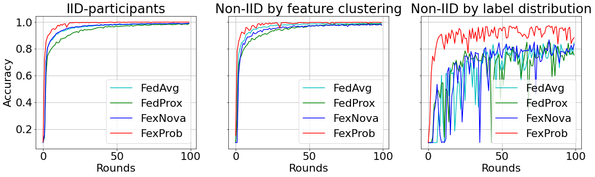
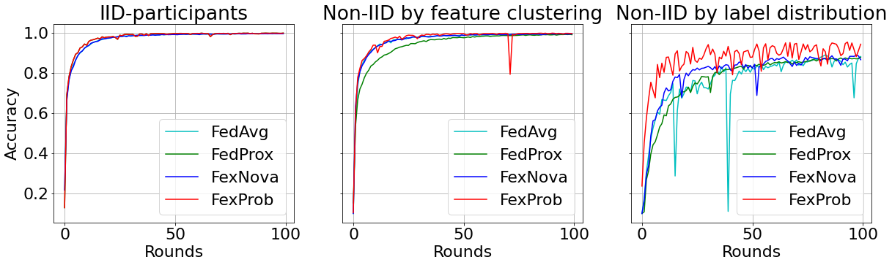

# Federated Learning on Non-IID Data
This is the experiment code with FedProb from the paper: "FedProb: An Aggregation Method Based on Feature Probability Distribution for Federated Learning on Non-IID Data" pulished at IEEE Bigdata 2022 Workshop on Cyber-Phisical System.

## Usage
Here is one example to run this code with our method ("fedprob"):
```
python experiments.py --model=simple-cnn \
    --dataset=cifar10 \
    --alg=fedprob \
    --lr=0.01 \
    --batch-size=64 \
    --epochs=10 \
    --n_parties=10 \
    --mu=0.01 \
    --rho=0.9 \
    --comm_round=50 \
    --partition=noniid-labeldir \
    --beta=0.5\
    --device='cuda:0'\
    --datadir='./data/' \
    --logdir='./logs/' \
    --noise=0 \
    --sample=1 \
    --init_seed=0
```


## Experiment on different setting

In this experiment code, fedprob can be tested with `model` = `simple-cnn`, `vgg`, `resnet` on `dataset`= `cifar`, `svhn`. We also add a method to partition data into cluser by defining `partition` = `cluster` on the above datasets.

Below is the setting from original code

| Parameter                      | Description                                 |
| ----------------------------- | ---------------------------------------- |
| `model` | The model architecture. Options: `simple-cnn`, `vgg`, `resnet`, `mlp`. Default = `mlp`. |
| `dataset`      | Dataset to use. Options: `mnist`, `cifar10`, `fmnist`, `svhn`, `generated`, `femnist`, `a9a`, `rcv1`, `covtype`. Default = `mnist`. |
| `alg` | The training algorithm. Options: `fedavg`, `fedprox`, `scaffold`, `fednova`. Default = `fedavg`. |
| `lr` | Learning rate for the local models, default = `0.01`. |
| `batch-size` | Batch size, default = `64`. |
| `epochs` | Number of local training epochs, default = `5`. |
| `n_parties` | Number of parties, default = `2`. |
| `mu` | The proximal term parameter for FedProx, default = `1`. |
| `rho` | The parameter controlling the momentum SGD, default = `0`. |
| `comm_round`    | Number of communication rounds to use, default = `50`. |
| `partition`    | The partition way. Options: `homo`, `noniid-labeldir`, `noniid-#label1` (or 2, 3, ..., which means the fixed number of labels each party owns), `real`, `iid-diff-quantity`. Default = `homo` |
| `beta` | The concentration parameter of the Dirichlet distribution for heterogeneous partition, default = `0.5`. |
| `device` | Specify the device to run the program, default = `cuda:0`. |
| `datadir` | The path of the dataset, default = `./data/`. |
| `logdir` | The path to store the logs, default = `./logs/`. |
| `noise` | Maximum variance of Gaussian noise we add to local party, default = `0`. |
| `sample` | Ratio of parties that participate in each communication round, default = `1`. |
| `init_seed` | The initial seed, default = `0`. |

## Reference Experiment Results





## Citation
If you find this repository useful, please cite our paper:

```
@inproceedings{nguyendv2022fedprob,
      title={FedProb: An Aggregation Method Based on Feature Probability Distribution for Federated Learning on Non-IID Data},
      author={Nguyen, Do-Van and Tran, Anh Khoa and Zettsu, Koji},
      booktitle={IEEE International Conference on Big Data},
      year={2022}
}
```

In addition, please cite the paper with the original code:
```
@inproceedings{li2022federated,
      title={Federated Learning on Non-IID Data Silos: An Experimental Study},
      author={Li, Qinbin and Diao, Yiqun and Chen, Quan and He, Bingsheng},
      booktitle={IEEE International Conference on Data Engineering},
      year={2022}
}
```
